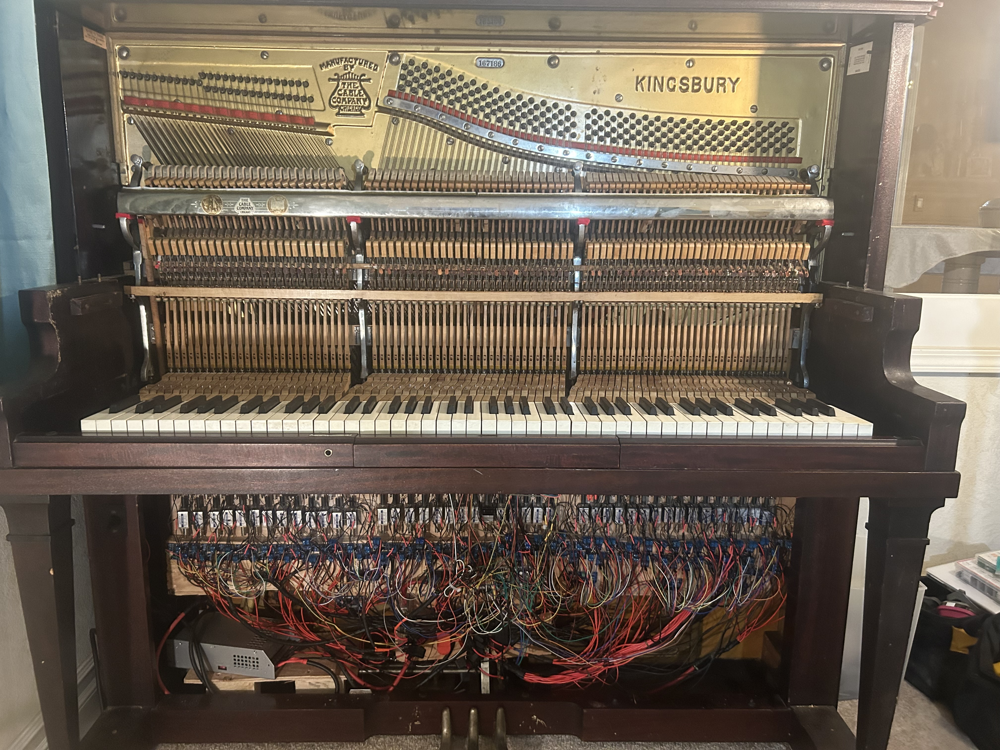
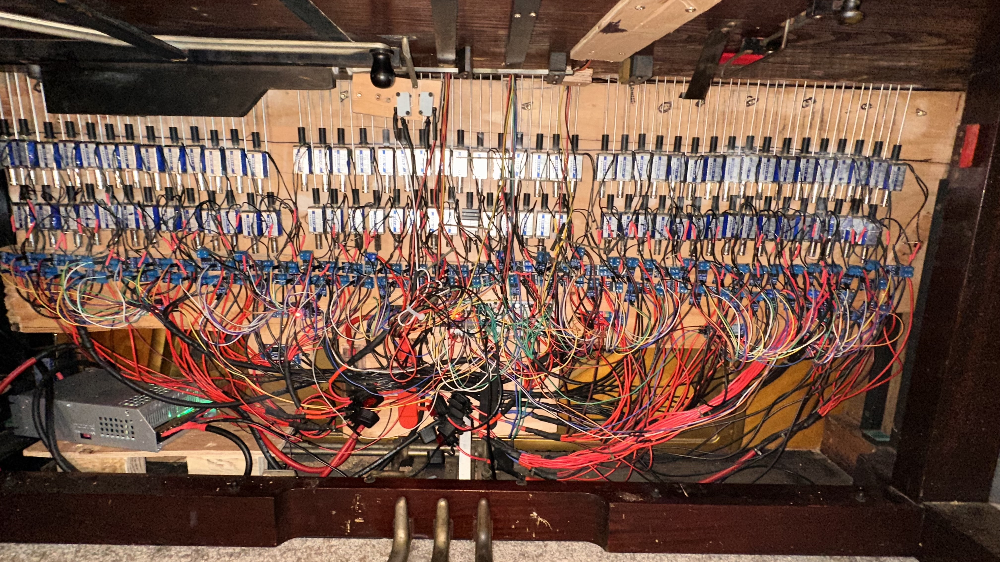

<p align="center">
  
</p>

# ML-Assisted Player Piano (ESP32 + PCA9685 + Solenoids)
> ⚠️This repository is not fully documented yet. More details, diagrams, and code explanations will be added soon. 
> 🎥 Curious what this project looks like in action?  
> Check out the demo videos!
### 🎥 Demo Videos
- **[Demo 1](media/IMG_6648%20%281%29.mov)** – A quick demo showing that I can play the piano manually while the system plays notes at the same time.

- **[Demo 2](media/IMG_6644.MOV)** – Full-speed performance of the intro to *Moonlight Sonata*, showing the entire piano as the system plays the piece smoothly and accurately.

- **[Demo 3](media/IMG_6645.MOV)** – Close-up view of the solenoids in action during *Moonlight Sonata*, demonstrating the mechanical precision and synchronized movement of the actuators.


### 📸 System Photos



This project is a full electro-mechanical system that turns a normal upright piano into a self-playing instrument using **MIDI, solenoids, machine-learning-assisted velocity mapping, and ESP32 firmware**.

I built this project after becoming obsessed with how real player pianos work and wanting to create a version that is **affordable, modular, and repairable**, using parts most makers can source easily.

This repository contains:
- Firmware for ESP32 + PCA9685 solenoid drivers  
- Hardware schematics + wiring diagrams  
- ML notebook for mapping MIDI velocity → PWM force  
- Photos / demos of the system in action

- This project is a fully functional **ML-assisted 88-key player piano** built on an ESP32.  
It features BLE-MIDI input, real-time solenoid control, temperature-aware safety logic, velocity mapping, and a predictive MIDI scheduling engine.

This is my most advanced embedded systems project, combining:
- C++ firmware design
- Real-time control loops
- Hardware engineering (MOSFET drivers, PCA9685 buses)
- Machine-learning-based velocity modeling


Anyone interested in building their own system or learning how mine works is welcome to clone or fork this repo.

---

# 🎹 Features

- Plays any MIDI file via **Bluetooth LE MIDI** or **USB MIDI**
- Supports **velocity-sensitive** playback (harder = louder)
- Controls all 88 keys + sustain pedal using solenoids
- Real-time scheduling for fast repeated notes
- Control box support (volume, mode, panic/reset)
- ESP32-based architecture for fast MIDI processing
- Discreet hardware mounting — piano still works manually
- Includes safety logic for temperature, stuck notes, and power limits

---

# 🛠 System Overview

## Hardware
- ~88 12V 400ma 10mm stroke key solenoids  
- 6× PCA9685 16-channel PWM drivers  
- 88 MOSFET boards for 12V solenoid switching  
- ESP32 (main processor)  
- DS18B20 temperature sensor  
- I²C OLED display + volume knobs + Buttons
- 100A 12V power rail  

Hardware diagrams live in:  
📁 `hardware/`

---

## Firmware
Firmware is split into modules:

| File | Purpose |
|------|---------|
| `main.cpp` | System init, BLE MIDI, loop control |
| `midi_handler.cpp` | MIDI parsing + predictive scheduling |
| `pwm_controller.cpp` | PCA9685 PWM control + solenoid drive |
| `safety_logic.cpp` | Overheat detection, stuck-note recovery, panic mode |

Entry point:  
📌 `firmware/main.cpp`

---

## Machine Learning (WIP)

Used to generate a regression model that maps:

**Key velocity → PWM pulse width → consistent loudness**

Includes:
- `model_training.ipynb`
- `trained_model.pkl`
- Example datasets showing force/dB curves

---

# 🚀 Getting Started

## 1. Clone the repo
```bash
git clone https://github.com/TobyM-engineering/ml-player-piano.git

2. Open the firmware

You can use:

VS Code + PlatformIO (recommended)

or Arduino IDE (with libraries): PCA9685, OneWire, DallasTemperature, MIDI

Firmware entry file: firmware/main.cpp

3. Flash the ESP32

Select your ESP32 board in PlatformIO/Arduino IDE

Choose the correct COM port

Upload firmware

Open serial monitor to verify MIDI events

⚠️ Safety Warning

Driving ~100 solenoids from a high-current 12V supply can be dangerous if done incorrectly.

Read:
👉 docs/safety_notes.md
before powering or testing this system.

📌 Repo Status

✅ Project structure + documentation

✅ Firmware skeleton added

⚙️ ML velocity not implimented into the Folder yet under development

🔬 Long-duration testing - minor fixes here and there but nothing that takes more than a minute

Repository Structure
ml-player-piano/
│
├── firmware/
│   ├── main.cpp
│   ├── midi_handler.cpp
│   ├── pwm_controller.cpp
│   └── safety_logic.cpp
│
├── docs/
│   ├── architecture.md
│   ├── midi_system.md
│   └── safety_notes.md
│
├── hardware/
│   ├── wiring_diagram.png
│   ├── pca9685_layout.png
│   └── solenoid_driver_schematic.jpg
│
├── ml-model/
│   ├── model_training.ipynb
│   ├── trained_model.pkl
│   └── data/
│       ├── sample_pressures.csv
│       └── sample_velocities.csv
│
├── media/
│   ├── demo1.mp4
│   ├── demo2.mp4
│   └── piano_photo.jpg
│
└── README.md
