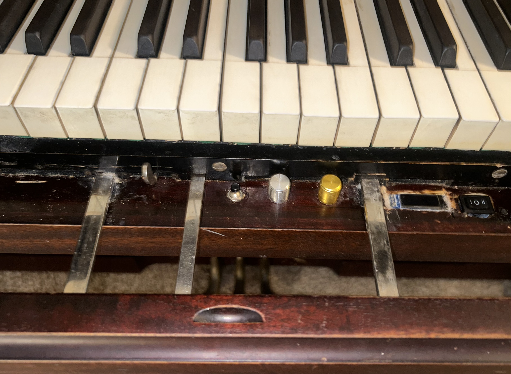

<p align="center">
  
</p>

# ML-Assisted Player Piano (ESP32 + PCA9685 + Solenoids)

> ⚠️ This repository is not fully documented yet — more diagrams, notes, and explanations will be added soon.  
> 🎥 See it in action below!

---

# 🎥 Demo Videos

- **[Demo 1](media/IMG_6648%20%281%29.mov)** – A quick demo showing that I can still play the piano manually while the system plays notes at the same time — a human + machine duet.

- **[Demo 2](media/IMG_6644.MOV)** – Full-speed performance of the intro to *Moonlight Sonata*, showing the entire piano as the system plays accurately and smoothly.

- **[Demo 3](media/IMG_6645.MOV)** – Close-up of the solenoids firing during *Moonlight Sonata*, highlighting actuator precision and timing.

---

# 📸 System Photos

### **Internal View of the System**

A look inside the instrument — solenoid rails, wiring bundles, and PCA9685 distribution. (Yes, it looks like a wild nest of wires — it wasn’t designed for beauty. I promise it’s much simpler than it seems, and proper diagrams are on the way)

### **Embedded OLED + Control Interface**

This screen and control interface sits where the original player-piano controls used to be.  
Since the 1900s pneumatic player mechanism was destroyed and partially burned, I replaced the entire control cluster with modern electronics: buttons, potentiometers, and switches — all mounted into the original wood frame.

### **Front Control Panel Under the Keys**

These knobs and switches replace the old pneumatic roll levers.  
They now control volume, mode selection (Left hand /Both hands /Right hand), octave shift, system power, and volume. (it wasn’t designed for beauty, it was designed to work  :)

---

# 🎹 Project Background

This piano originally used a **vacuum-driven pneumatic system** built in the early 1900s — powered by foot pedals that pulled air through a paper roll.  
When I got it from OfferUp, the system was:

- non-functional  
- missing tubing and bellows  
- partially burned  
- too heavy to move without fully disassembling it
- $20

I rebuilt the piano structurally, but the original player system was beyond repair.  
So instead, I designed and built a **modern, fully electronic self-playing system**, turning an antique into a hybrid electromechanical instrument.

This project combines:
- Embedded systems engineering  
- Real-time MIDI processing  
- Machine-learning velocity mapping  
- Hardware and electrical design  
- Large-scale actuator control (88 solenoids)

Anyone is welcome to clone or fork this project to learn from it or build their own version.

---

# 🛠 System Overview

## Hardware
- ~88 × 12V solenoids  
- 6 × PCA9685 16-channel PWM drivers  
- 88 MOSFET channels  
- ESP32 MCU (BLE MIDI + control loop)  
- DS18B20 temperature sensor  
- I²C OLED display  
- Volume knobs + mode switch + panic/reset  
- 100A 12V power rail  

Hardware diagrams: **`hardware/` folder**

---

## Firmware Modules

| File | Purpose |
|------|---------|
| `main.cpp` | System init, UI, BLE MIDI, control loop |
| `midi_handler.cpp` | MIDI parsing + predictive scheduling |
| `pwm_controller.cpp` | Solenoid PWM + pulse-width control |
| `safety_logic.cpp` | Overheat detection, stuck-note recovery, panic mode |

Entry point: **`firmware/main.cpp`**

---

# 🤖 Machine Learning (WIP)

A regression model is being developed to map:

**MIDI velocity → PWM pulse width → consistent loudness**

Includes:
- `model_training.ipynb`
- `trained_model.pkl`
- Force/dB datasets

---

# 🚀 Getting Started

## 1. Clone the repo
```bash
git clone https://github.com/TobyM-engineering/ml-player-piano.git


2. Open the firmware

Use:

VS Code + PlatformIO (recommended)
or

Arduino IDE with libraries: PCA9685, OneWire, DallasTemperature, MIDI

Main file: firmware/main.cpp

3. Flash the ESP32

Select your board

Choose correct COM port

Upload firmware

Open Serial Monitor to verify MIDI events

⚠️ Safety Warning

Driving ~100 solenoids from a high-current 12V supply can be dangerous.
Before powering anything, read:

👉 docs/safety_notes.md

📌 Repo Status

✅ Project structure + documentation

✅ Firmware modules implemented

⚙️ ML velocity mapping in progress

🔧 Hardware stable + long-duration testing


ml-player-piano/
│
├── firmware/
│   ├── main.cpp
│   ├── midi_handler.cpp
│   ├── pwm_controller.cpp
│   └── safety_logic.cpp
│
├── docs/
│   ├── architecture.md
│   ├── midi_system.md
│   └── safety_notes.md
│
├── hardware/
│   ├── wiring_diagram.png
│   ├── pca9685_layout.png
│   └── solenoid_driver_schematic.jpg
│
├── ml-model/
│   ├── model_training.ipynb
│   ├── trained_model.pkl
│   └── data/
│       ├── sample_pressures.csv
│       └── sample_velocities.csv
│
├── media/
│   ├── IMG_6648 (1).mov
│   ├── IMG_6644.MOV
│   └── IMG_6645.MOV
│
└── README.md
