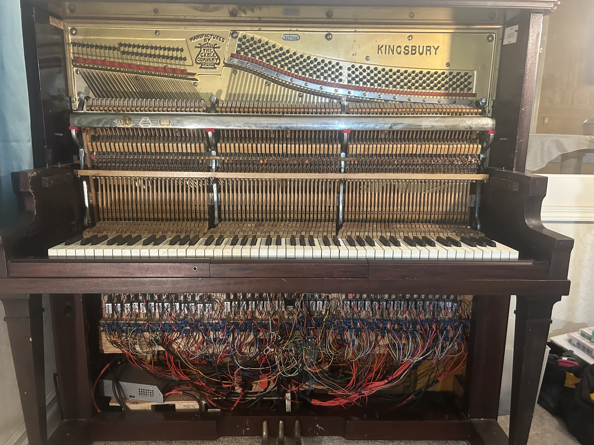
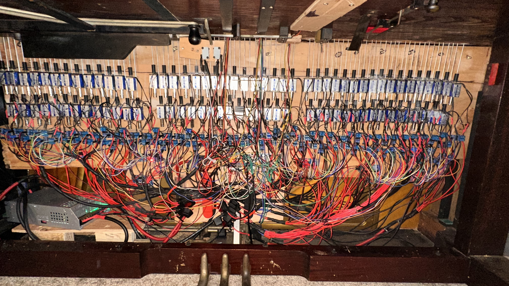
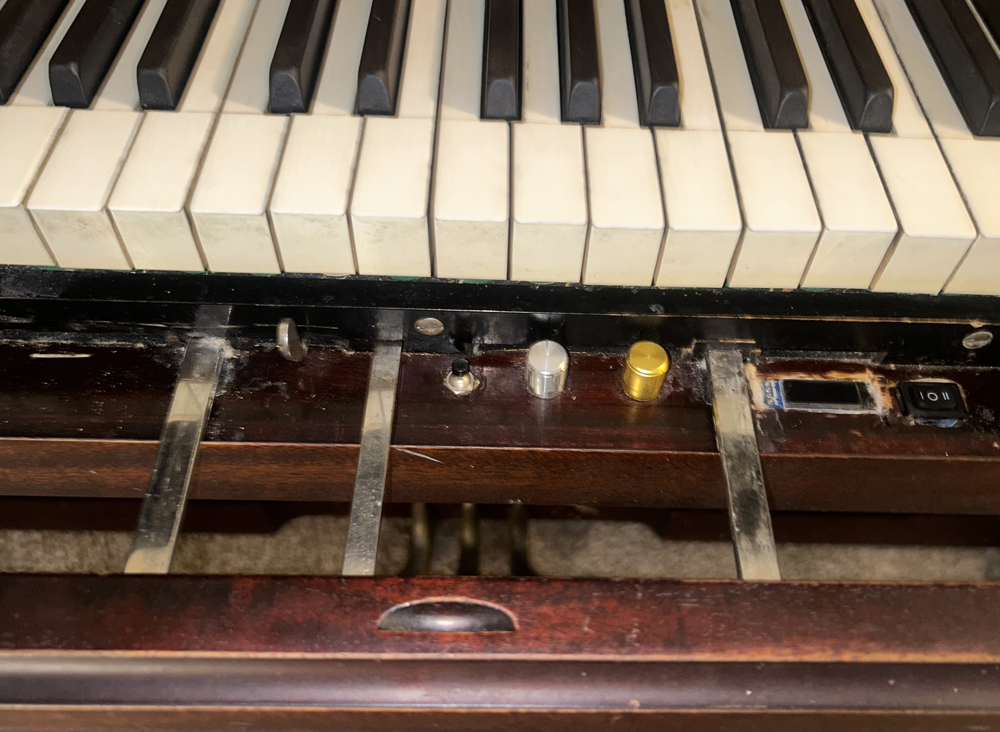

<p align="center">
  
</p>

# Player Piano
<p align="center">
  
  
  
  
  
</p>

A full electromechanical player piano system combining embedded C++, real-time MIDI processing, PCA9685-controlled solenoids, and a machine-learning velocity model trained on decibel measurements to produce human-like dynamics. Built to retrofit an early-1900s pneumatic piano into a modern expressive instrument.

> ⚠️ This repository is not fully documented yet — more diagrams, notes, and explanations will be added soon.  
> 🎥 See it in action below!

---

# 🎥 Demo Videos

- **[Demo 1](media/IMG_6648%20%281%29.mov)** – A quick demo showing that I can still play the piano manually while the system plays notes at the same time — a human + machine duet.

- **[Demo 2](media/IMG_6644.MOV)** – Full-speed performance of the intro to *Moonlight Sonata*, showing the entire piano as the system plays accurately and smoothly.

- **[Demo 3](media/IMG_6645.MOV)** – Close-up of the solenoids firing during *Moonlight Sonata*, highlighting actuator precision and timing.

---

# 📸 System Photos

### **Internal View of the System**

A look inside the instrument — solenoid rails, wiring bundles, and PCA9685 distribution. (Yes, it's a nest of wires — it wasn’t designed for beauty)

### **Embedded OLED + Control Interface**

This screen and control interface sits where the original player-piano controls used to be.  
Since the 1900s pneumatic player mechanism was destroyed and partially burned, I replaced the entire control cluster with modern electronics: buttons, potentiometers, and switches — all mounted into the original wood frame.

### **Front Control Panel Under the Keys**

These knobs and switches replace the old pneumatic roll levers.  
They now control volume, mode selection (Left hand /Both hands /Right hand), octave shift, system power, and volume. (it wasn’t designed for beauty, it was designed to work  :)

---

# 🎹 Project Background

This piano originally used a **vacuum-driven pneumatic system** built in the early 1900s — powered by foot pedals that pulled air through a paper roll.  
When I got it from OfferUp, the system was:

- non-functional  
- missing tubing and bellows  
- partially burned  
- too heavy to move without fully disassembling it
- $20

I rebuilt the piano structurally, but the original player system was beyond repair.  
So instead, I designed and built a **modern, fully electronic self-playing system**, turning an antique into a hybrid electromechanical instrument.

This project combines:
- Embedded systems engineering  
- Real-time MIDI processing  
- Machine-learning velocity mapping  
- Hardware and electrical design  
- Large-scale actuator control (88 solenoids)

Anyone is welcome to clone or fork this project to learn from it or build their own version.

---

# 🛠 System Overview

## Hardware
- ~88 × 12V solenoids  
- 6 × PCA9685 16-channel PWM drivers  
- 88 MOSFET channels  
- ESP32 MCU (BLE MIDI + control loop)  
- DS18B20 temperature sensor  
- I²C OLED display  
- Volume knobs + mode switch + panic/reset  
- 100A 12V power rail  

Hardware diagrams: **`hardware/` folder**

---

## Firmware Modules

| File | Purpose |
|------|---------|
| `main.cpp` | System init, UI, BLE MIDI, control loop |
| `midi_handler.cpp` | MIDI parsing + predictive scheduling |
| `pwm_controller.cpp` | Solenoid PWM + pulse-width control |
| `safety_logic.cpp` | Overheat detection, stuck-note recovery, panic mode |

Entry point: **`firmware/main.cpp`**

---
(The coolest Part)
🎼 Machine Learning for Human-Like Piano Dynamics

One of the hardest parts of any DIY player piano or just player pianos in general, is avoiding the robotic sound you get when the system simply reads MIDI velocity values and triggers solenoids.
MIDI only tells you two things about a note:

Which key to play

How fast the key should be played (velocity 1–127)

But MIDI velocity is not the same as real hammer force, and it contains zero information about the true sound level of a physical piano.
So if you directly map MIDI velocity → PWM, every key ends up sounding stiff, uneven, or mechanical.

To fix this, I collected real data.

📊 Data Collection: Decibel Measurements Per Solenoid

I used a calibrated decibel meter to measure how loud each solenoid strikes the string at different PWM pulse widths.
For every solenoid, I logged:

Solenoid ID

PWM duty cycle

Pulse duration

Measured dB (sound intensity)

Original MIDI velocity

This produced a dataset showing how each individual key responds to different energies.
Because every solenoid + key mechanism is slightly different (tension, friction, mass, age), the system cannot rely on one universal formula — it needs per-solenoid correction.

🤖 Why Machine Learning Is Needed

The relationship between:

MIDI velocity

Physical solenoid force

Hammer speed

Actual loudness (dB)

…is non-linear and varies across all 88 keys.

A human pianist naturally adjusts finger pressure, timing, and key speed to produce expressive dynamics.
A raw MIDI file does not include those subtleties.

The ML model compensates by learning:

How hard each solenoid must strike to sound like a given velocity

How to smooth out jumps between velocities (avoiding robotic jumps in loudness)

Timing corrections so repeated notes feel more natural

How to equalize loudness across all keys so chords sound balanced

🎹 Result: More Expressive, Human-Like Playback

After training the model, it outputs a mapping table the ESP32 uses in real time.
This allows the player piano to:

Produce consistent loudness across all keys

Reduce mechanical harshness

Imitate human-style touch response

Create smoother crescendos and phrasing instead of "MIDI stiffness"

In short:

The ML layer transforms simple MIDI velocity data into expressive, natural-sounding piano dynamics that feel far more human and musical.

---

# 🚀 Getting Started

## 1. Clone the repo
```bash
git clone https://github.com/TobyM-engineering/ml-player-piano.git


2. Open the firmware

Use:

VS Code + PlatformIO (recommended)
or

Arduino IDE with libraries: PCA9685, OneWire, DallasTemperature, MIDI

Main file: firmware/main.cpp

3. Flash the ESP32

Select your board

Choose correct COM port

Upload firmware

Open Serial Monitor to verify MIDI events

⚠️ Safety Warning

Driving ~100 solenoids from a high-current 12V supply can be dangerous.
Before powering anything, read:

👉 docs/safety_notes.md

📌 Repo Status

✅ Project structure + documentation

✅ Firmware modules implemented

⚙️ ML velocity mapping in progress

🔧 Hardware stable + long-duration testing


ml-player-piano/
│
├── firmware/
│   ├── main.cpp
│   ├── midi_handler.cpp
│   ├── pwm_controller.cpp
│   └── safety_logic.cpp
│
├── docs/
│   ├── architecture.md
│   ├── midi_system.md
│   └── safety_notes.md
│
├── hardware/
│   ├── wiring_diagram.png
│   ├── pca9685_layout.png
│   └── solenoid_driver_schematic.jpg
│
├── ml-model/
│   ├── model_training.ipynb
│   ├── trained_model.pkl
│   └── data/
│       ├── sample_pressures.csv
│       └── sample_velocities.csv
│
├── media/
│   ├── IMG_6648 (1).mov
│   ├── IMG_6644.MOV
│   └── IMG_6645.MOV
│
└── README.md
